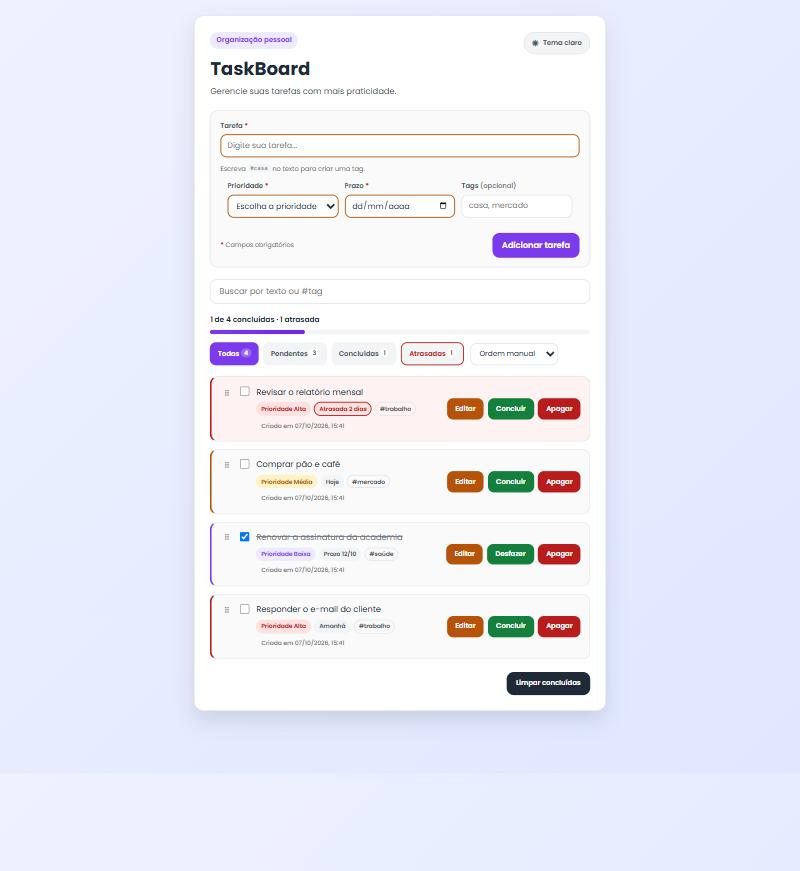
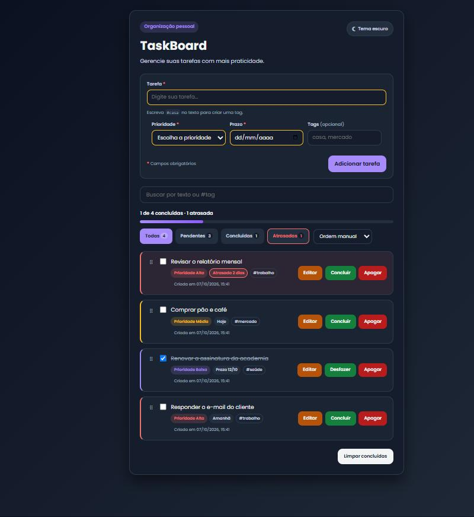

# ✅ TaskBoard

Gerenciador de tarefas em **HTML, CSS e JavaScript puro** — sem framework, sem
bundler, sem nenhuma dependência instalada. Os dados ficam no próprio navegador
e o app funciona offline.

| Tema claro                                                    | Tema escuro                                                     |
| ------------------------------------------------------------- | --------------------------------------------------------------- |
|  |  |

## ✨ Funcionalidades

**Tarefas**

- Adicionar, editar e apagar, com confirmação antes de apagar
- Concluir e reabrir
- Edição rápida com duplo clique no texto, ou pelo modal completo
- **Texto, prioridade e prazo são obrigatórios**, na criação e na edição
- Prioridade (alta, média, baixa), com cor na borda do item
- Prazo em linguagem corrente: "Hoje", "em 3 dias", "Atrasada 2 dias"
- Tags opcionais — escreva `#casa` no texto e ela vira uma tag
- Reordenar arrastando pela alça, ou pelo teclado com `Alt` + `↑` / `↓`

**Organização**

- Busca por texto ou tag
- Filtros: todas, pendentes, concluídas e atrasadas, cada um com contagem
- Ordenação: manual, prioridade, prazo, mais recentes, mais antigas
- Contador com barra de progresso
- Limpar todas as concluídas de uma vez

**Segurança dos dados**

- Salvamento automático, com formato versionado e migração automática
- Leitura à prova de falhas: JSON corrompido é isolado em vez de quebrar o app
- Desfazer em tudo que apaga tarefas
- Sincronização entre abas abertas ao mesmo tempo

**Interface**

- Tema claro, escuro ou seguindo o sistema
- Instalável como aplicativo (PWA) e funcional offline
- Responsiva, navegável por teclado e compatível com leitores de tela

## 🚀 Como rodar

O app usa **módulos ES** e um **service worker**, e os dois exigem `http://` —
abrir o `index.html` direto do disco (`file://`) não funciona.

```bash
node servidor.mjs
```

Depois abra <http://localhost:8000>. Para outra porta: `node servidor.mjs 3000`.

Qualquer alternativa serve igual, se preferir:

```bash
npx serve .
python -m http.server 8000
```

## 🧪 Testes

As regras de negócio e a persistência são funções puras, testáveis sem
navegador, com o runner que já vem no Node:

```bash
node --test "testes/**/*.test.js"
```

São 61 testes cobrindo filtros, ordenação, reordenação, validação, geração de
ids e os casos de falha da persistência: JSON corrompido, migração de formato,
ids repetidos, registros inválidos e armazenamento cheio.

## ⌨️ Teclado

| Tecla             | Ação                                              |
| ----------------- | ------------------------------------------------- |
| `Enter`           | Adiciona a tarefa / salva a edição                |
| `Esc`             | Fecha o modal ou cancela a edição rápida          |
| `Tab`             | Navega; dentro de um modal o foco fica preso nele |
| `Alt` + `↑` / `↓` | Move a tarefa na ordem manual, com a alça em foco |
| Duplo clique      | Edita o texto no próprio item                     |

## 📁 Estrutura

```
index.html              Marcação, formulários e modais
manifest.webmanifest    Metadados do PWA
service-worker.js       Cache offline (rede primeiro, cache como reserva)
servidor.mjs            Servidor estático local, só com o Node
assets/
  css/style.css         Folha única, com os tokens de cor dos dois temas
  js/
    main.js             Ponto de entrada: liga eventos às operações
    constantes.js       Chaves, limites e enums
    tarefas.js          Regras de domínio (funções puras)
    storage.js          Persistência, validação e migração de versão
    estado.js           Estado central e caminho único de mutação
    dom.js              Referências de DOM
    render.js           Renderização da lista e do resumo
    modais.js           Abrir/fechar, foco preso e devolvido
    toast.js            Avisos com "Desfazer"
    tema.js             Claro / escuro / sistema
    formato.js          Formatação de datas
testes/                 Testes com node --test
```

## 🏗️ Como funciona

**Estado → render, num sentido só.** A fonte da verdade é o objeto `estado`.
Toda mutação de tarefas passa por um caminho único, `atualizarTarefas()`, que
persiste e avisa quem assina — o `render.js` refaz a lista inteira.

**Formato versionado.** As tarefas são gravadas como `{ versao, tarefas }`. Ao
mudar a forma delas, sobe-se a versão e trata-se a anterior em `migrar()`. O
app já migrou da v1 (array cru, ids numéricos) até a v4 sem perder dados.

**Regras de domínio isoladas.** `tarefas.js` não toca em DOM nem em
`localStorage`, e `storage.js` recebe o depósito por parâmetro — é o que
permite testar tudo sem navegador.

## 🛠️ Tecnologias

HTML5, CSS3 (custom properties, grid, flexbox), JavaScript ES2022 (módulos
nativos), Web Storage, Service Worker e Drag and Drop API.

## 👨‍💻 Autor

Desenvolvido por **Anderson Luiz**.
